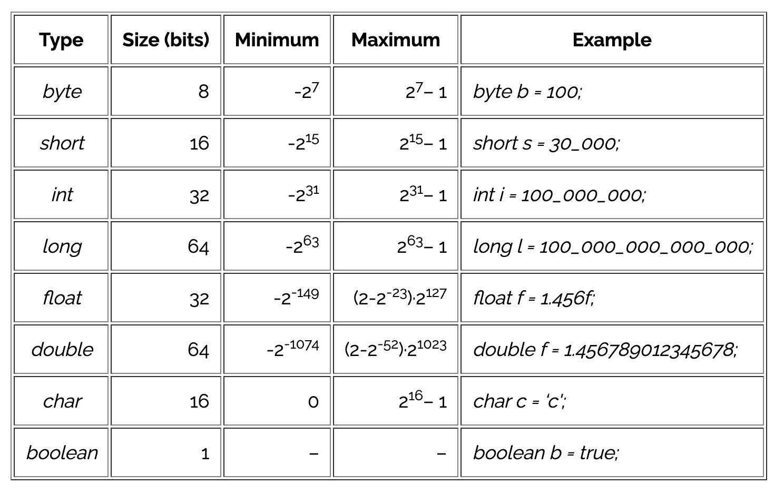

# Day 2 - Demonstration

## Rapid fire questions from yesterday

### Is there a null type in Java ?

Yes, its `null` but a `void` return type returns literally nothing, whereas `null` is technically a value. 

### Console log ?

Use `System.out.println(String msg)`

### int vs Integer ? 

Integer is a class, int is a primitive. Recall the chart:

These are the **primitive** types. They directly correspond to a VALUE rather than a CLASS. 

So, the Integer is a wrapper class. It essentially represents an `int` but gives us some extra methods to work with to make our lives eaiser.

The same is true about String. A String is a wrapper class for an array of `char` types.

You can learn more using the Java docs:

https://docs.oracle.com/en/java/javase/11/docs/api/java.base/java/lang/Integer.html

https://docs.oracle.com/en/java/javase/11/docs/api/java.base/java/lang/String.html

This is also a good time to demystify reading docs because they can be really intimidating

## Getting Visibility / Debugging Demo

- As mentioned above our first tool is System.out.printLn("my message"). It's ugly and long but it's effective. Since most Java apps won't be run on the terminal (for example real user I/O would not be done via printLn, you'd probably have some form of GUI)

- We can also use the IntelliJ debugger if we want.
  - Breakpoint Step Over / Step Into / Step Out
  - Stop, Rerun
  - Show passed / ignored tests
  - Switch between console and debugger
  - Gradle as a test runner, gradle report

## Lists 

Lists is an example of an interface, which I'll be going over in tomorrow's demo/workshop. You'll also be learning about lists in the bank tech test repo
